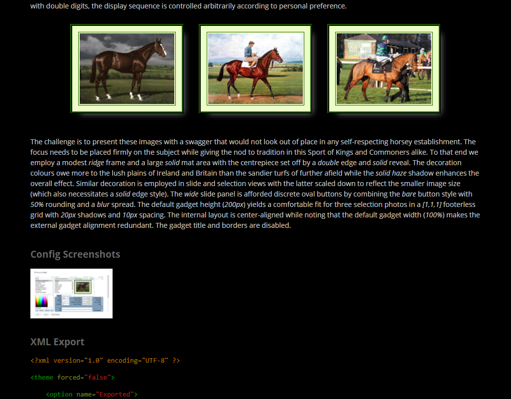

# Photofeed Gadget User Guide

By RVJ Callanan

Originated: 2009-11-23; last updated: 2016-07-02

## Contents

* [Introduction]
  * [Background]
  * [Features]
  
* [Site Preparation]
  * [Gadget Hosting]
  * [Cabinet Source Directory]
  * [Domain Alias]
  * [Theme File]
    * [Theme Element]
    * [Option Elements]
    * [Parameter Elements]
    * [Theme Maintenance]
  * [Sample Setup]
  
* [Image Management]
  * [Image Organisation]
  * [Image Limits]
    * [Source Size]
    * [Cabinet Size]
    * [Image Size]
  * [Format Support]
  * [Normalisation]
  * [Filenames and Sorting]
  * [Creating a New Cabinet]
  * [Uploading and Captioning]
  
* [Gadget Usage]
  * [Gadget Views]
    * [Selection View]
    * [Slide View]  
  * [Gadget Insertion]  
  * [Gadget Configuration]
    * [Custom Configuration]
    * [Standard Configuration]
  * [Gadget Toolbar]
    * [Gadget Properties]
    * [Gadget Alignment]
    * [Gadget Wrapping]
    * [Gadget Removal]
  * [Gadget Test]
  
* [Configuration Reference]
  * [Primary Controls]
    * [Cabinet Source]
    * [Cabinet Selector]
    * [Cabinet]
    * [Lead Selector]
    * [Lead]
    * [Image Preview]
    * [Theme Selector]
    * [Colour Swatch]
    * [Primary Buttons]
      * [XML]
      * [Refresh]
      * [Defaults]
      * [Apply]
  * [General Controls]
    * [Text]
    * [Link]
    * [Link New]
    * [No Slides]
    * [No Symbols]
    * [Wrap]
    * [Grid]
    * [Ref Height]
    * [Defer Cache]
    * [Align]
    * [Padding]
    * [Guide Metrics]
      * [Static Height]
      * [Compact Width]
      * [Selection Overhead]
      * [Slide Overhead]
  * [Selection Controls]
    * [Selection Decoration]
    * [Footer]
      * [Footer Color]
      * [Footer Height]
      * [Footer Style]
    * [Hover Color]
    * [Layout]
      * [Exact]
      * [Trim Min]
      * [Trim Max]
      * [Push Min]
      * [Push Max]
      * [Pull Min]
      * [Pull Max]
  * [Slide Controls]
    * [Slide Decoration]
    * [Upper]
      * [Upper Color]
      * [Upper Height]
      * [Upper Style]
    * [Lower]
      * [Lower Color]
      * [Lower Height]
      * [Lower Style]
    * [Panel]
      * [Panel Color]
      * [Panel Height]
      * [Panel Opacity]
      * [Panel Style]      
    * [Buttons]
      * [Button Color]
      * [Button Radius]
      * [Button Style]
    * [Spread]
      * [Spread Color]
      * [Spread Width]
      * [Spread Style]
    * [Beckon Color]
    * [Glow Color]
  * [Decoration Controls]
    * [Frame]
      * [Frame Color]
      * [Frame Width]
      * [Frame Style]
    * [Shape]
      * [Shape Color]
      * [Shape Radius]
      * [Shape Style]
    * [Mat]
      * [Mat Color]
      * [Mat Width]
      * [Mat Style]
    * [Edge]
      * [Edge Color]
      * [Edge Width]
      * [Edge Style]
    * [Reveal]
      * [Reveal Color]
      * [Reveal Width]
      * [Reveal Style]
    * [Shadow]
      * [Shadow Color]
      * [Shadow Width]
      * [Shadow Style]
    * [Space]
      * [Space Color]
      * [Space Width]
      * [Space Style]
  * [Standard Controls]  
    * [Gadget Width]
    * [Gadget Height]
    * [Gadget Scrollbars]
    * [Gadget Border]
    * [Gadget Title]
    * [Standard Buttons]
      * [OK]
      * [Cancel]
      * [Gadget Preview]
  * [Theme-Only Parameters]
    * [Localisation Parameters]
      * [Lang Help]        
      * [Lang Close]    
      * [Lang First]   
      * [Lang Last]     
      * [Lang Previous] 
      * [Lang Next]  
      * [Lang Skip Back]  
      * [Lang Skip Ahead] 
      * [Lang View More]  
      * [Lang Read More] 
      * [Lang Loading]  
    * [Miscellaneous Parameters]
      * [Cache Defer Time]
      * [Show Loading Delay]
      * [Use Image Proxy]
      * [Capture Keys]
      * [Clean Caption]
      * [Clean Title]

* [Appendices]
  * [Themeable Parameters]
  * [Sample XML Export]
  * [Errors]
  * [Screenshots]


# Introduction

## Background

Although images are ubiquitous in modern Web sites, they are increasingly
prone to casual embedding which is a particular bugbear of Content
Management Systems such as [Google Sites]. This *scatter effect* has been
exacerbated by the gadget craze which often flies in the face of sound
design and management principles.

This leads to disturbing questions for Google Sites administrators:

* Why can't I find a unified solution for *all* our image requirements?
* Are our site contributors all singing from the same hymn-sheet?
* Are we losing control of our image content?
* How does this affect our legal/regulatory obligations?
* Are we succumbing to duplication-of-effort?
* Is our site genuinely autonomous and self-contained when it comes to images?
* How susceptible is our image content to outside forces?
* Where are our images actually stored?
* How do we modify previously uploaded images without having to re-edit pages?
* How do we purge orphan images so they can never be used again?
* How do we curb the proliferation of image duplicates?
* Are image files and links correctly preserved in site copies and backups? 
* Why do our image gadgets stick out like a sore thumb? 
* Why is gadget customisation so basic, disjointed and unreliable?
* Does page layout have to be so hit-and-miss with images and gadgets?
* How do we avoid these tiresome *edit-configure-save-refresh-test* cycles?

Google Sites is supposed to facilitate content creation, modificaton and
maintenance in collaborative environments. However, when you scratch the
surface, sites developed on this platform are hard to manage unless you
restrict yourself to built-in gadgets and internal text-based content.

The Photofeed gadget was designed to address all of these issues and more.
By organising your image back-ends and front-ends around this gadget, they
become first-class citizens — just like text — in the content management
stakes. The gadget name is an historical artefact. All image types are
supported, although photographic images will account for the majority of
use cases. In this guide, the terms *photo* and *image* are interchangable.


## Features

The Photofeed gadget was developed for [Google Sites] to provide a fast and
versatile front-end for image back-ends based on local or foreign file
cabinets.

* Two image views are supported which cater for the most common presentation
  requirements. 
  
* Both views are generated inline using dynamic HTML which precludes the
  need for pop-up windows.
  
* The default selection view can display one or more images in an auto-fit
  grid with optional footer.
  
* The optional slides view is available via a single click with or without
  dynamic height adjustment.
  
* Each view supports independent layout and decoration parameters.

* A comprehensive configuration menu caters for a wide variety of tastes.
  
* Other parameters anticipate common modes of operation.   
  
* Over 100 parameters are supported using an efficient packing scheme to
  bypass the *UserPref* limits of the Gadget API.
  
* Parameter values and defaults can be customised using site-specific themes
  specified in a dedicated theme file.
  
* An efficient configuration dialog enhances productivity for both general
  gadget usage and theme testing.
  
* Page layout assistance is provided by means of dedicated parameters and
  guide metrics.
  
* Fast image retrieval is assured using Google's Image Proxy service.

* Seamless slide transitions are assisted by an internal look-ahead cache.

* Localisation support for non-English sites is provided via the theme file.
  
* Gadget code and build tools are open-sourced for end-to-end control and
  peace-of-mind.
  

# Site Preparation

## Gadget Hosting

We recommend that you host your own independent copies of any public gadgets
used on your sites. This will give you the requisite control of gadget updates
and versioning. The sad fact is that Google's public repostory has fallen into
general neglect over the years and become saturated with poorly maintained
gadgets. Some gadget publishing tools have also been discontinued.

Bear in mind that a number of old unsupported versions of the Photofeed gadget
are in circulation, possibly with different names. The latest version is now
open-sourced. Source code, documentation, build tools and output files can be
downloaded from the [Photofeed Gadget GitHub Repository]. To re-build your own
custom version with alternative hard preferences and other tweaks, please
refer to the [Photofeed Gadget Developer Guide]

> **Note**
>
> It is *not* possible to serve static HTML or XML content on a [Google Sites]
> file cabinet — or a GitHub repository for that matter — since this would
> expose these services to abuse. So even if a valid gadget file exists at
> either of these locations, it cannot be accessed using the [Gadget Insertion]
> dialog. The simplest hosting solution in the Google ecosystem is
> [Google Cloud Storage], but any genuine Web host will do.

If you are just experimenting with the Photofeed gadget, you may want to link
to the latest official build on our dedicated host. This is used by our
[Classic Google Sites Demo] and will remain viable for the foreseeable
future. It can be accessed using the following URL:

    http://rep.rvjc.com/gadgets/photofeed.xml

If gadget usage is restricted on your [Google Sites] domain, you may need to
have your chosen version of the Photofeed gadget whitelisted. Please refer
to the [Google Gadget Guide] for more information.


## Cabinet Source Directory

The Photofeed gadget is designed to access image collections stored in local
or foreign file cabinets. A file cabinet is a special type of [Google Sites]
page that facilitates file uploads, downloads and listings. Photofeed image
cabinets are located under a [Cabinet Source] directory which is a standard
[Google Sites] Web page containing a built-in [Sub-Page Listing Gadget].
Source directories and underlying cabinets must have public read access.

Any mix of local or foreign source directories can be accessed on any given
site; however, gadget usage is more streamlined if the majority of images
are obtained from a single local [Cabinet Source]. For historical reasons,
the default [Cabinet Source] is `/photos`, although this can be changed via
the [Theme File].


## Domain Alias

The Photofeed gadget makes intelligent assumptions about the [Cabinet Source]
address. For example, the hostname `www.example.com` is assumed to be an alias
for site name `www` on [G Suite] domain `example.com`. Therefore, if you are
using domain aliases, we recommend that you enforce one-to-one mappings between
sub-domains and site names. This is not strictly necessary because a more
explicit [Cabinet Source] address notation can be used; however, it makes life
easier for Photofeed gadget users on foreign domains who require regular access
to your images. For example, your site could be a central image repository used
by other feeder sites, possibly on different domains. Or there may be a loose
association between sites which require occasional access to each others images
e.g. on a university campus.


## Theme File

If you wish to use the optional gadget theme file (which has nothing to do with
standard site themes), it must comply with our improvised gadget theme standard.
While the contents of the file are gadget-specific, it must be uploaded to a
generic `themes` file cabinet under the `/sys` directory with public read access.
The filename requires a domain prefix so as not to conflict with theme files from
other gadget developers using the same standard (not that this is very likely).
On that basis, the Photofeed Gadget expects to find its theme file for the
current site at the following address:

    /sys/themes/rvjc.com.photofeed.xml

If you wish to change these hard theme file and directory defaults, you will
need to create your own custom gadget build. For further instructions, please
refer to the [Photofeed Gadget Developer Guide].

Even if you are not using themes, we recommend that you include a dummy theme
file at the required location as this will speed up initial gadget loading times.
The XML snippet below is a good candidate as it specifies the (superfluous)
built-in default for [Ref Height] which is the most likely parameter to require
customisation.

```xml

<?xml version="1.0" encoding="UTF-8" ?>
<theme forced="false">
    <option name="Standard">
        <p name="refHeight" default="400"/>
    </option>
</theme> 

```

This template is easily extended to suit your needs by familiarising yourself
with a few basic elements and attributes. Useful guidance can be gleaned from
the [Sample XML Export] which references all [Themeable Parameters] and thus
represents the ultimate in theme control. In practice, we rarely need to go to
such extremes.

### Theme Element

The `<theme>` element at the root of the XML tree contains a single `forced`
attribute and one or more [Option Elements]. If the `forced` attribute is set
to `"false"`, each theme option, including the reserved `disabled` option, will
be accessible via the [Theme Selector] during [Gadget Configuration]. Theme
options can be thought of as useful templates for a variety of gadget insertion
scenarios while also giving the user the freedom to avoid themes altogether for
maximum configuration control. When the `forced` attribute is set to `"true"`,
every instance of the Photofeed gadget on your site will have its configuration
forced to the first theme option while any remaining options will be ignored.

### Option Elements

Each `<option>` element contains a single `name` attribute and one or more
[Parameter Elements]. The `name` attribute identifies the theme option in the
[Theme Selector] during [Gadget Configuration]. Any sensible `name` can be
used apart from `"disabled"` which is reserved.

### Parameter Elements

Each `<p>` element contains a `name` attribute and either a `value` or
`default` attribute (but not both). An abbreviated tag name is used since
parameter elements can be be quite numerous. The `name` attribute corresponds
to the *variable name* in the [Themeable Parameters] list which also includes
useful information on default values and ranges. The `value` attribute locks
the corresponding parameter during [Gadget Configuration] whenever the parent
theme option is selected or forced. The `default` attribute only affects the
parameter's initial value during configuration which can then be modified at
will. Some parameters, such as the [Cabinet Source], only support the `default`
attribute because locking the value would be too restrictive. Other parameters,
such as the [Cabinet] and [Lead] image are not themeable at all for obvious
reasons.

### Theme Maintenance

By its very nature, the theme file can be modified as your site evolves and
the Photofeed gadget has sensible fallbacks for ill-advised modifications
such as deleted theme options or incoherent changes to the *forced* attribute.
However, in the interests of good management, the more fundamental aspects of
theme control should be settled from the outset while maintenance tasks should
generally be restricted to tweaking existing theme options or adding new
options.

> **Note**
>
> Gadget instances remember their last saved configurations even when they are
> based on theme options that have since been deprecated due to option deletion
> or theme forcing. Gadget instances bound to deprecated options will continue
> to work as originally configured even if some parameters are over-ridden by
> a forced theme. However, if you attempt to reconfigure the gadget, you will
> receive a warning as it unbinds itself from the deprecated theme option
> (without changing any other settings). The [Theme Selector] will then revert
> to *disabled* or the alternative forced theme. Any gadgets still bound to a
> deprecated theme option will re-assimilate theme changes if the deprecated
> option is restored. What all this means in practice is that no serious
> damage will accrue if you temporarily mess up your [Theme File] as long as
> this is rectified before page editors start to notice.


## Sample Setup

Our [Classic Google Sites Demo] showcases a sample working Photofeed setup.
You can traverse the relevant directories and pages on this site via the
sitemap link.


# Image Management

## Image Organisation

Image collections (or photo albums) are grouped within distinct file cabinets.
Always be mindful that your images can be displayed by any number of gadgets,
with any number of configurations, on any number of pages, within any number
of sites. So keep your cabinets and their contents as generic as possible in
this regard.

It is often forgotten that the Photofeed gadget's customisation and management
features can be leveraged for routine image embedding. However, even when
images are intended to be displayed individually, they still have to be
grouped within (and possibly split across) file cabinets.

## Image Limits

### Source Size

A [Cabinet Source Directory] can hold an arbitrary number of file cabinets.
However, for performance reasons, the Photofeed gadget imposes its own limit
of 999 image cabinets per source.

### Cabinet Size

File cabinets can hold an arbitrary number of files. However, for performance
reasons, the Photofeed gadget imposes its own limit of 99 images per cabinet.

### Image Size

The maximum image size is entirely browser-dependent. In practice, this will
be limited by page dimensions and Internet bandwidth.


## Format Support

The Photofeed gadget depends entirely on the browser for image format support
and ignores any meta data contained within image files. The gadget has been
tested successfully on mainstream browers with [JPEG] and [PNG] formats. We
recommend that you use standard `.jpg` and `.png` file extensions.


## Filenames and Sorting

When displaying multiple images, the Photofeed gadget respects the default
alphanumeric sorting used by the file cabinet. Since this is based on the
filename (and not the caption), a predictable relationship between the two
will serve the interests of good housekeeping and general sanity, e.g. the
filename could be a lower case version of the caption with hypenated spaces.
Alternatively, you can control the display sequence arbitrarily by prefixing
the filename with one or more digits, e.g. a 2-digit prefix can be used to
manually sort up to 99 photos within a cabinet. Similarly, a date prefix
based on a `year-month-day-time` format will sort images chronologically.


## Normalisation

Before uploading images to a cabinet, they are typically "normalised" by
resizing to a standard [Ref Height] which maximises image quality and
rendering performance in [Slide View]. It is good practice to scale and crop
to the nearest *even* dimensions. Although this is not strictly necessary, it
produces identical pixel metrics in each quadrant which is important for
symmetry-sensitive features such as mat patterns and rounding.

Widely-varying aspect ratios are best avoided within a cabinet unless the images
are to be displayed individually. Wider images will dominate in [Slide View]
while the dominant dimensions in [Selection View] will depend on the [Grid]
characteristics and the exact mix of images. Since the cabinet contents can
change over time, this should not be left to chance.

There are times when you will want to preserve the original image dimensions,
e.g. with graphical images or screenshots which can scale unpredictably. In
this case, the gadget's [Ref Height] should match the raw image height and,
where possible, image heights should be consistent throughout the cabinet.

The default [Ref Height] is 400px which can be changed in the [Theme File].
This is a good trade off between image quality and file size (and therefore
download time). It also allows wider images to fit across a typical page in
[Slide View] when rendered in their original size (while also allowing for
decoration overhead).


## Creating a New Cabinet

When creating a file cabinet page under the [Cabinet Source Directory],
give it a brief title which adequately describes the image collection.
Depending on your gadget configuration, the title may be displayed in the
[Footer] in [Selection View] and the [Upper] or [Lower] text elements in
[Slide View].


## Uploading and Captioning

Images are ideally uploaded in advance of gadget insertion as it takes a few
minutes before these changes are assimilated by Google's feed cache and image
proxy. Alternatively, you can enable the [Defer Cache] option in the gadget
configuration dialog to disable caching until the changes have been reliably
assimilated. 

Images are typically bulk-uploaded to the file cabinet and then individually
captioned via the cabinet's file description fields. As with the cabinet
title, captions should be brief and to the point. While captions are highly
recommended, they are not strictly necessary. The Photofeed gadget can handle
images that have been lazily uploaded, i.e. without captions. However, if the
images are likely to be displayed in multiple selections or slide shows,
captioning should not be done in a piecemeal fashion — either caption all of
the images within a cabinet or none.


# Gadget Usage

If the Photofeed gadget is used on your site, it is likely to be a critical,
all-encompassing component as far as image content is concerned. It does not
lend itself to casual use like other public gadgets — either you fully embrace
its back-end/front-end toplogy or you do not. Given the level of committment
involved, much of the design effort has focussed on optimising the viewing
and configuration experience. On both counts, this gadget is fast, intuitive
and reliable as long as the [Site Preparation] steps have been followed
correctly. Gadget usage is even more streamlined when the optional
[Theme File] is used to its full potential.


## Gadget Views

The Photofeed gadget supports two distinct views which cater for the most
common image presentation requirements. Both views are generated inline using
dynamic HTML which precludes the need for pop-up windows. Sample views are
available in the [Screenshots] appendix and these can be tested interactively
in the [Photofeed Showcase] section of our [Classic Google Sites Demo].
 
### Selection View

This is the default gadget view which cannot be disabled. It supports single
or multiple images in a column-oriented [Grid] with optional [Footer]. The
images are individually framed (or unframed) against a transparent or solid
background with optional spacing and shadows.

Routine selection configuration is performed via the [General Controls] while
the more abundant and finely-tuned selection parameters are consolidated under
the [Selection Controls] which are typically regulated by the [Theme File].
The latter includes a rich menu of [Decoration Controls] .

The selection images are arranged in columns whose characteristics are
controlled by the [Grid] and [Layout] parameters. The available grid/column
height depends on the [Gadget Height] and [Footer] metrics (if the footer is
enabled). The images are individually scaled to produce an exact horizontal
and vertical fit in each column while also allowing for framing, spacing and
shadows. This means that fewer images within a column will produce larger
image sizes. For practical and aesthetic reasons, a left-to-right bias is
enforced whereby a column may not contain fewer images than a previous column.

Since everything is referenced to the [Gadget Height], the image aspect ratios
have a large bearing on column and grid widths. Wider images in single-image
columns will expand and dominate the grid while narrow images will contract
the grid and dominate multi-image columns. The overall result will depend on
the grid characteristics and the exact mix of images; however this should not
be left to chance as the cabinet contents may change over time. For that
reason, widely-varying aspect ratios are generally avoided within a cabinet
unless the images are to be displayed individually.

The selection [Grid] can accommodate up to 20 columns and up to 20 images per
column; however the limiting factor is more likely to be the external gadget
dimensions (not to mention Internet bandwidth). An insufficient [Gadget Width]
will produce horizontal truncation while an insufficient [Gadget Height] will
trigger a gadget error. Either outcome will be immediately apparent in the
[Gadget Preview] or when the page containing the misconfigured gadget is
saved.

> **Note**
>
> Due to [Google Gadget API] limitations, it it is not possible to validate
> the [Gadget Height] and [Gadget Width] during [Gadget Configuration].

The [Lead Selector] determines the first image in the [Grid] while the [Wrap]
control allows the grid to progress beyond the last image in the cabinet by
looping around to the first. If there are not enough images to fill the
specified [Grid], the more nuanced aspects of [Grid] behaviour are controlled 
by the [Layout] parameter under the [Selection Controls]. This is a good
candidate for theme regulation since it figures out sensible fall-back
arrangements when the nominal grid capacity exceeds the number of available
images.

The optional [Footer] displays the image caption or cabinet title in the case
of multiple selections (or if a single selection image was lazily uploaded
without a caption). The custom [Text] parameter over-rides this auto-generated
[Footer] content. The obligatory link symbol to the right of the footer text
can be disabled using the [No Symbols] option for a less "noisy" effect.

While the [Footer Height] is controlled directly; the footer width corresponds
to the [Grid] width. If this is not sufficient, the footer text will not be
displayed to avoid unseemly truncation although there should be enough room
for the link symbol. This problem is more likely to happen with single column
grids containing multiple narrow images. In this case the footer should probably
be disabled as it would compound the absurdity of such an narrow grid.
Alternatively, you can increase the [Gadget Height] to scale up the [Grid] and
[Footer] width. More generally, this problem can be avoided by keeping cabinet
titles, image captions and custom text as concise as possible.

Clicking on the [Footer] causes a transition to [Slide View] starting at the
first image in the selection. An alternative starting point can be selected
by clicking on the image itself. This behaviour can be disabled using the
[No Slides] option in which case the target URL reverts to the raw source
cabinet image (thus bypassing Google's Image Proxy). A custom URL can be
specified with the [Link] parameter while the [Link New] option determines
if the target URL opens in a new tab/window.

### Slide View

Slide view is available via a single click in [Selection View] assuming the
[No Slides] option has *not* been enabled and the [Link] parameter is left
blank. As we have already seen, the opening slide depends on the [Lead] image
and click context in [Selection View]. If this is not the first image in the
cabinet, the user can back-track over previous slides even if they are not
visible in the original selection.

Routine slide configuration is performed via the [General Controls] while
the more abundant and finely-tuned slide parameters are consolidated under
the [Slide Controls] which are typically regulated by the [Theme File].
The latter includes a rich menu of [Decoration Controls].

> **Note**
>
> Selection and slide decoration are controlled independently. In a typical
> scenario, the larger and more intricate slide decoration is scaled down in
> [Selection View] to reflect the smaller image sizes. Of course, decoration
> can be completely different in each view, e.g. large selection grids can
> avoid clutter by employing minimal decoration (or no decoration at all).

Slide images are displayed with a constant [Ref Height] which excludes any
decoration overhead. This parameter is typically (but not necessarily)
identical to the original image height for optimal rendering quality and
performance. Whereas the internal [Selection View] dimensions are auto-scaled
to fit the external [Gadget Height], the external [Slide View] dimensions are
calibrated to the internal [Ref Height] and other slide metrics. This would
normally entail a dynamic height adjustment between views which shifts any
page content inserted after the gadget. However, this can be averted by
setting the [Gadget Height] to the [Static Height] calculation available
in the [Guide Metrics]. 

Slide progression is controlled via the optional [Panel] using the *First*,
*Last*, *Next*, *Previous*, *Skip Ahead* and *Skip Back* buttons. The *Left
Arrow* and *Right Arrow* keys mimic the *Previous* and *Next* buttons while
the *Space* bar continues the forward or reverse progression one slide at a
time. A look-ahead cache delivers seamless transitions when the slides are
viewed in a consistent progression at a non-frenetic pace. Hitting the
*Escape* key or clicking on the slide image or *Close* button will return to
[Selection View] and re-adjust the gadget to its original height (if necessary).
The *Help* button opens a simple pop-up summarising the keyboard shortcuts.

> **Note**
>
> The keyboard shortcuts can be disabled by setting the theme-only
> [Capture Keys] parameter to `"false"`.
>

When the final slide is reached in either direction, progression is normally
halted (or reversed when the space bar is used). This behaviour is modified
by the [Wrap] control which maintains the progression direction by looping
around from the last image in the cabinet to the first (and vice versa).  

The optional [Upper] and [Lower] text elements are located above and below
the [Panel]. Normally, the [Upper] element displays the caption of the current
slide while the [Lower] element displays the cabinet title along with the slide
index and total. However, sensible fall-backs are employed when the image
caption is unavailable or when either element is disabled.


## Gadget Insertion

The *Insert -> More Gadgets* dialog is used to insert your gadget on a new
or existing page. You will be prompted for one of three gadget sources:

1. Whitelisted gadgets for your *Domain*.
2. The *public* gadget directory.
3. Self-hosted gadgets using the *Add Gadget by URL* option.

As of mid-2016, the publishing tools required for *Option 1* are deprecated
while *Option 2* applies to older gadgets no longer in active maintenance.
On that basis, the only viable option for new gadget builds is *Option 3*.
This requires you to enter the gadget URL manually, typically through the
expedient of a copy-and-paste. This is actually faster and far more reliable
than trawling through the public gadget directory. If you haven't yet gotten
around to self-hosting, the latest official Photofeed build is hosted on our
domain at:

    http://rep.rvjc.com/gadgets/photofeed.xml
    
For more information, please refer to the [Gadget Hosting] section.


## Gadget Configuration

Having followed the Photofeed [Gadget Insertion] procedure on a new or
exisiting page, you will be taken immediately to the configuration dialog in a
scrollable modal pop-up window. This dialog is also accessible for previously
inserted gadgets using the [Gadget Properties] button in the [Gadget Toolbar].

The standardised configuration interface is geared towards simple gadgets with
just a handful of user preferences. So it presents a serious design challenge
for the Photofeed gadget with its high concentration of settings. As with all
public gadgets, the configuration window is shared between custom and standard
controls. These are enumerated in the [Configuration Reference].

### Custom Configuration 

The top of the configuration window is reserved for custom controls. This is a
tight fit for the Photofeed gadget whose custom controls are just about visible
in the default unscrolled view. The [Primary Controls] are so-named because they
are *directly* accessible. However, in the interests of space conservation and
clarity, secondary controls are consolidated under tabs. The [General Controls]
tab is active by default since it is more likely to be accessed during routine
gadget configuration. The remaining tabs, containing the [Selection Controls]
and [Slide Controls], are hidden by default since they have high concentrations
of finely-tuned parameters which are more likely to be regulated by the
[Theme File].

### Standard Configuration 

The [Standard Controls] are identical for all gadgets although there may be
slight implementation differences. These are located towards the bottom of the
configuration window. The [Standard Buttons] are always visible (regardless of
scrolling); however, due to the space pressure, you will need to scroll down
to access the remaining standard controls.


## Gadget Toolbar

When editing a page, gadgets will appear as blank white frames displaying the
gadget name. Public gadgets are distinguished from built-in gadgets by also
displaying the "Google Gadget" monicker. Clicking on the gadget will expose a
simple toolbar either above or below the frame as the page view allows. This
toolbar contains the following buttons and button groups:

### Gadget Properties

This button re-enters the [Gadget Configuration] dialog when further
modifications are required.

### Gadget Alignment

Not to be confused with the internal [Align] setting, the gadget *Align Left*,
*Align Right* and *Align Centre* buttons change the external gadget alignment
across the page. These settings have no effect when the [Gadget Width] is set
to 100%.

### Gadget Wrapping

Not to be confused with the internal [Wrap] setting, the gadget *Wrap On*
and *Wrap Off* buttons control whether page text wraps around the gadget.
The precise wrapping behaviour will depend on the [Gadget Alignment] setting.
The [Gadget Height] and [Gadget Width] are easily optimised for wrapping
using the Photofeed [Guide Metrics]. 

### Gadget Removal

This button removes the gadget from the page.


## Gadget Test

This simple test will verify that your Photofeed front-ends and back-ends are
working correctly. You will then have the confidence to explore the gadget's
full feature-set by experimenting with the [Gadget Configuration] dialog and
[Theme File] while dipping into the [Configuration Reference] when further
clarification is required.

First you will need to create a test page anywhere on your site. While in page
edit mode, follow the Photofeed [Gadget Insertion] procedure which will take
you to the [Gadget Configuration] dialog. The [Cabinet Selector] will list all
cabinets under the default [Cabinet Source] while the [Lead Selector] will list
all image files in the selected cabinet. The first entry in each list is selected
by default. You can change either selection or the [Cabinet Source] itself while
verifying that all is well in the [Image Preview]. If a [Theme File] is used
on your site, you can also verify its functionality via the [Theme Selector].
Any source, cabinet, image or theme errors will be flagged in red in the
status area just above each control.

If recently-created cabinets or recently-uploaded images are not listed,
enable the [Defer Cache] option under the [General Controls] and all should be
revealed. If you are still having problems viewing cabinets which you know to
be present, ensure that the [Cabinet Source Directory] page exists and contains
a built-in [Sub-Page Listing Gadget] — this is a common oversight for first-time
users. You may also want to verify that the [Cabinet Source Directory] and
underlying cabinets all have public read access (the latter usually follows from
the former). As a last resort, you should check against a known reliable source,
e.g. `cgs.rvjc.com/photos` in the [Classic Google Sites Demo]. If this works,
at least you know your gadget is good before retracing your [Site Preparation]
steps. Once these initial niggles are sorted, you should never have to re-visit
them again.

If all is well, click the [OK] button to save the gadget configuration and
then save the page itself to verify that both [Gadget Views] are working as
expected. Bear in mind that the default gadget configuration is somewhat bland.
This stems from a desire to give every decoration feature a moderate airing
using conservative colours that will blend in with the most common light and
dark backgrounds. For more interesting configuration samples, check out these
[Screenshots] of the [Photofeed Showcase] on our [Classic Google Sites Demo].

> **Note**
>
> It is good practice to refresh a saved page before testing the gadget. This
> will pre-empt a well-known [Google Sites] dynamic-height adjustment issue
> which does *not* arise during normal page viewing.


# Configuration Reference

## Primary Controls

### Cabinet Source

This is the address of the local or foreign [Cabinet Source Directory]
containing the required image collection. The source status (just above the
control) gives the [Cabinet Selector] index and total number of source
cabinets. An error is indicated in red.

The source address defaults to `/photos` although this can be changed in the
[Theme File]. To specify an alternative source, just enter the URL manually.
The protocol and hostname are optional. If the protocol is not specified and
cannot be determined by other means, it defaults to the protocol of the
current site. If the hostname is not specified, it defaults to the current
host.

Shorthand address notation is supported using special symbols:

* A leading `/` implies that the source address is relative to the current
  domain using the format: `/<site name>/<address>`.

* The `~` symbol is shorthand for `sites.google.com` offering a quick and
  reliable way of specifying an internal [Google Sites] address.
  
The absence of a leading symbol *and* hostname implies that the address is
relative to the URL of the current site. This is the most common usage and
also ensures that gadgets accessing local images are duplicated correctly
when making site copies or backups.

The following sample addresses are based on the [Classic Google Sites Demo]:

    photos
    http://photos
    https://photos

    cgs.rvjc.com/photos
    http://cgs.rvjc.com/photos

    /cgs/photos
    http:///cgs/photos
    https:///cgs/photos

    ~/a/rvjc.com/cgs/photos
    http://~/a/rvjc.com/cgs/photos
    https://~/a/rvjc.com/cgs/photos

    sites.google.com/a/rvjc.com/cgs/photos
    http://sites.google.com/a/rvjc.com/cgs/photos
    https://sites.google.com/a/rvjc.com/cgs/photos

> **Note**
>
> Modern browsers will prevent access to non-secure content from secure pages.
> This is complicated by the fact that [Google Sites] may serve secure and
> non-secure versions of your site simultaneously depending on whether it is
> accessed via an internal [Google Sites] address or [Domain Alias]. A further
> complication arises when a user signs on via a domain alias which will then
> revert to the internal [Google Sites] address. On that basis, it is usually
> better to leave out the protocol in the source address so the gadget can
> choose the most sensible default based on the context.

### Cabinet Selector

Located under the [Cabinet Source] control, this scrollable selector lists by
title all of the available cabinets. The first cabinet is selected by default
which you will probably want to change by clicking on the relevant entry. You
may need to use the [Defer Cache] option to view a recently-created cabinet.

### Cabinet

This read-only control displays the URL stub of the selected cabinet. The
cabinet status (just above the control) gives the selected image index and
the total number of images in the cabinet. An error is indicated in red.

### Lead Selector

Located under the [Cabinet] control, this scrollable selector lists all of the
available cabinet images by caption. Any images that have been lazily uploaded
without captions will be listed as *(Uncaptioned No. X)*. The first image is
selected by default which you can change by clicking on the relevant entry.
You may need to use the [Defer Cache] option to view a recently-uploaded
image. The selected image is known as the [Lead] since it is the first to be
displayed in multiple selections and slide shows.

### Lead

This read-only control displays the filename of the selected lead image, thus
completing its full address. The lead status (just above the control) gives
the original image dimensions. An error is indicated in red. 

### Image Preview

The rectangular area under the [Lead] control gives an instant preview of the
lead image and decoration settings albeit on a compact white background. The
dotted perimeter delineates any shadow and spacing effects. The decoration
preview is bound to the active tab. The selection preview is activated by the
*general* or *selection* tabs and the slide preview by the *slides* tab. The
decoration settings are faithfully reproduced in both cases; however, the
image itself is auto-scaled to fit the small preview area. This tends to
exaggerate the decoration metrics relative to the image size, especially in
slide previews. You can click on the image to generate an undecorated pop-up
view in its original size. Alternatively, you can click the [Gadget Preview]
button for a more authentic, if less immediate, result.

### Theme Selector

The theme selector is located on the top-right and the theme status is just
above the control. An errored status is indicated in red. One of three
scenarious are possible:

1. If a [Theme File] is _not_ present, the theme status will show up as
   *Unavailable* and the theme selector will be permanently *Disabled*.
   
2. If a valid [Theme File] is present and it contains at least one *forced*
   theme, the theme status will show up as *Forced* and the theme selector
   will be permanently set to the forced theme.
  
3. If a valid [Theme File] is present and none of the specified themes are
   forced, the theme status will show up as *Optional* and the theme selector
   will default to *Disabled*; however, any of the optional themes can be
   selected.

When the theme is disabled, all configuration parameters are adjustable and
will initialise to built-in defaults. When a *forced* or *optional* theme is
selected, some parameters may be locked while others may assume different
defaults.

### Colour Swatch

The colour swatch tool is a handy alternative to entering hex color values,
especially when experimenting with new themes. As you hover over the colour
or greyscale grid, the sample color will change. When you find the right shade,
a simple click will update the active colour and the accompanying hex value.
Alternatively, you can enter the hex colour manually or select a standard
colour from the drop-down list. Non-standard colours will show up as *CUSTOM*.
The sample colour is just below the active colour for easy comparison and to
facilitate minor tweaks. The active swatch colour can be applied to any of
the colour controls by clicking on the associated *Apply Swatch* button.

### Primary Buttons

#### XML

This button generates a theme-ready XML export of the current configuration in
a scrollable pop-up window. Portions of this output can be copied and pasted
into a [Theme File]. The [Sample XML Export] was generated using this feature
which is indispensible for theme testing.

#### Refresh

This button is rarely used since automatic refreshes are performed when
relevant controls are updated. However, manual refreshes are occasionally
required, e.g. after an Internet glitch or when a temporary back-end problem
is resolved while the configuration dialog is active.

#### Defaults

This button resets any relevant controls to their built-in or theme defaults.
If the [Cabinet Source] is already set to the default, the [Cabinet Selector]
and [Lead Selector] controls will *not* be affected. Otherwise, they will
default to the first cabinet under the default source and the first image in
the cabinet.

#### Apply

This is really a comfort button since configurations changes are applied
automatically as individual controls are updated. However, it also pre-empts
a bug in some versions of *Interent Explorer* which fail to generate a change
event when the [OK] button is clicked *before* moving the focus away from an
updated control.


## General Controls

Located under the *General* tab which is active by default, these secondary
controls are regularly accessed during routine gadget configuration:

### Text

This parameter over-rides the default footer text in [Selection View] which is
normally auto-generated from the image caption or cabinet title.

### Link

This parameter modifies the gadget's click behaviour in [Selection View] to open
a specific URL thus bypassing [Slide View] (or the raw image URL if the [No Slides]
option is enabled). This will also modify the selection footer link symbol (unless
the [No Symbols] option is enabled).

### Link New

This option determines if a custom [Link] opens in a new browser tab/window. It
also affects click behaviour in [Selection View] when the [No Slides] option is
enabled.

### No Slides

This option disables [Slide View] by modifying the gadget's click behaviour even
when the [Link] parameter is empty. In this case the target URL will revert to
the original image source address within the file cabinet, thus bypassing
Google's Image Proxy.

### No Symbols

The [No Symbols] option disables the selection footer link symbol to the right
of the footer text to produce a less "noisy" effect.

### Wrap

This option ensures that image progressions in [Selection View] or [Slide View]
loop around from the last image in the cabinet to the first (and vice versa).
This is especially useful when the [Lead] image is not the first item in the
cabinet.

### Grid

This parameter controls the basic image arrangement in [Selection View]. For
example, a value of 1 (which is the built-in default) specifies a single image.
This parameter can accept multiple values, delimited by commas, which correspond
to the maximum number of images in each column. The more nuanced aspects of grid
behaviour are controlled by the [Layout] parameter. For more information, refer
to the [Selection View] section.

### Ref Height

This parameter controls the raw image height (excluding decoration) in [Slide
View]. This is typically (but not necessarily) identical to the original height
of the uploaded images for optimal rendering quality and performance. The gadget
would normally adjust its height in [Slide View] to accommodate this setting and
other slide metrics; however, this can be averted by setting the [Gadget Height]
to the calculated [Static Height] in the [Guide Metrics]. For more information,
refer to the [Slide View] and [Uploading and Captioning] sections.

### Defer Cache

This option postpones caching for 4 hours after the gadget's last modification
time. This conservative defer period can be tweaked via the [Cache Defer Time]
parameter in the [Theme File]; however, it should not be less than 15 minutes.
You can enable this option if recent back-end changes affecting your gadget are
not showing up having not yet been assimilated by Google's Feed Cache or Image
Proxy. When caching is deferred, the parameter color changes to red to underline
its significance.

If the [Gadget Configuration] is re-edited after the defer period has elapsed
(and caching is active), the redundant [Defer Cache] option will be automatically
reset. However, it can be re-enabled any time, e.g. if more recent back-end
changes are not getting through to the gadget. In general, it is best to avoid
the need for cache deferral by creating new cabinets and uploading images well
ahead of gadget insertion.

### Align

This parameter controls the _internal_ alignment in both [Gadget Views]. It also
determines the position of the selection footer and slide panel relative to the
image centerpiece. Valid options are: *Left*, *Right* and *Centre*.

### Padding

This parameter controls the _internal_ padding in both [Gadget Views]. This is
useful in close-fitting page layout scenarios or when the page and gadget
backgrounds are *not* identical.

### Guide Metrics

When tweaking non-trivial page layouts, the following calculations are
indispensible given the complex inter-dependencies between gadget, image
and decoration metrics.

#### Static Height

This is the [Gadget Height] that preserves the vertical dimensions in
[Slide View] which would normally perform a dynamic height adjustment. 

#### Compact Width

This is the minimum [Gadget Width] that avoids horizontal truncation in either
view. The `A>B`, `A<B` or `A=B` prefix provides a handy width comparison
between views (A = selection, B = slides). A perfect fit in both [Gadget Views]
is indicated by an `A=B` prefix which is something of a rarity. We are usually
quite happy to settle for `A>B` so that the default [Selection View] is an exact
fit. When the [No Slides] option is enabled, the **B** in the compact width
prefix is replaced with an **X** to underline its irrelevance. This calculation
assumes a fixed aspect ratio throughout the cabinet. It is only meaningful with
single image selections and will display a _GRID!!_ warning if that is not the
case. 

#### Selection Overhead

This is the total overhead in [Selection View] expressed in *Horizontal x Vertical*
pixels. Since selection elements cannot exist to the left or right of the grid, the
horizontal metric represents the pure image decoration (excluding spacing) while
the vertical metric includes the footer overhead (if enabled). This calculation is
only meaningful with single image selections and will display a _GRID!!_ warning
if that is not the case. 

#### Slide Overhead

This is the total overhead in [Slide View] expressed in *Horizontal x Vertical*
pixels. Since slide elements cannot exist to the left or right of the slide, the
horizontal metric represents the pure image decoration while the vertical metric
includes any overhead associated with the panel, upper and lower elements
(including any intervening spacing).

## Selection Controls

Located under the *Selection* tab which is hidden by default, these secondary
controls are typically regulated by the [Theme File].

### Selection Decoration

This is controlled using an independent set of [Decoration Controls].

### Footer

This text element is located below the [Grid]. It displays useful information
about the selection.

#### Footer Color

This is the foreground colour of the footer text. The background depends on the
[Space Style].

#### Footer Height

This is the overall height of the footer in pixels. 

#### Footer Style

This determines the weight and height of the footer text relative to the
[Footer Height]. The text is always centered vertically so that larger
text produces a tighter fit. Horizontal alignment depends on the [Align]
setting. Footer text is rendered in the default *Sans Serif* font as per
the site theme.

Option                   | Description
:------------------------|:-----------------------------------------------------
*None*                   | No footer
*Normal S*               | Normal weight; small height (25%)
*Normal M (default)*     | Normal weight; medium height (50%)
*Normal L*               | Normal weight; large height (75%)
*Bold S*                 | Bold weight; small height (25%)
*Bold M*                 | Bold weight; medium height (50%)
*Bold L*                 | Bold weight; large height (75%)

### Hover Color

When the mouse hovers over the footer, its foreground colour will change to this
colour. This behaviour can be effectively disabled by making the [Hover Color] and
[Footer Color] identical.

### Layout

This parameter controls the more nuanced aspects of [Grid] behaviour when its nominal
capacity exceeds the number of available images. In that respect it is a good
candidate for theme control.

Option             | Description
:------------------|:-------------------------------------------------------------
*Exact (default)*  | Possibly non-rectangular; no image dropping; fully consistent 
*Trim Min*         | Rectangular; some image dropping; reasonably consistent
*Trim Max*         | Rectangular; more image dropping; fully consistent 
*Push Min*         | Rectangular; no image dropping; more consistent on left
*Push Max*         | Rectangular; no image dropping; more consistent on right
*Pull Min*         | Rectangular; no image dropping; most consistent on left
*Pull Max*         | Rectangular; no image dropping; least consistent in middle

These options require further clarification:

#### Exact

This is the default layout option delivering the best dimensional consistency
without dropping any images. However, in the event of an image shortfall, the
available images may not be displayed in a perfect rectangular block. Only
whole columns can be omitted and then only when the image shortfall matches
the capacity of the dropped column(s). Unless these columns have single image
capacities in a strip-style grid, they are likely to be partially filled in
which case the missing image dimensions are based on the average aspect ratio
of the available images.

#### Trim Min

A partially filled last column is discarded if it contains fewer images than
the second last column. This option is used when you want a perfect rectangular
block while maintaining a reasonably consistent layout without dropping too
many images.
               
#### Trim Max

A partially filled last column is completely discarded. This option is used
when you want a perfect rectangular block while maintaining a fully consistent
layout at the expense of dropping images more often.
                
#### Push Min

Column image numbers are reduced in a left-to-right direction starting at the
first column. The last column takes up the slack until it reaches the same
number of images as the second last column. This option is used when you want
a perfect rectangular block without discarding any images. It has the added
advantage of displaying the left-most images at the maximum size.
                
#### Push Max

Column image numbers are reduced in a left-to-right direction starting at the
first column. The last column takes up the slack until it reaches its capacity.
This option is more severe than *Push Min* but delivers better rightward
consistency which is especially useful when displaying small thumbnails. 

#### Pull Min

Column image numbers are reduced in a right-to-left direction starting at the
second last column. The last column takes up the slack until it reaches same
number of images as the second last column. This option differs from *Push Min*
by delivering more consistency on the left extreme which is often important
because this is where the eye tends to drop.
              
#### Pull Max

Column image numbers are reduced in a right-to-left direction starting at the
second last column. The last column takes up the slack until it reaches its
capacity. This option is more severe than *Pull Min* but it delivers better
consistency at the left and right extremities of a large grid at the expense
of the middle columns.


## Slide Controls

Located under the *Slides* tab which is hidden by default, these secondary
controls are typically regulated by the [Theme File].

### Slide Decoration

This is controlled using an independent set of [Decoration Controls].

### Upper

This text element is located above the [Panel]. It displays useful information
about the current slide.

#### Upper Color

This is the foreground colour of the upper text. The background depends on the
[Space Style].

#### Upper Height

This is the overall height of the upper element in pixels. 

#### Upper Style

This determines the weight and height of the upper text relative to the
[Upper Height]. The text is always centered vertically so that larger
text produces a tighter fit. Horizontal alignment depends on the [Align]
setting. Upper text is rendered in the default *Sans Serif* font as per
the site theme.

Option                   | Description
:------------------------|:-----------------------------------------------------
*None*                   | No upper element
*Normal S*               | Normal weight; small height (25%)
*Normal M (default)*     | Normal weight; medium height (50%)
*Normal L*               | Normal weight; large height (75%)
*Bold S*                 | Bold weight; small height (25%)
*Bold M*                 | Bold weight; medium height (50%)
*Bold L*                 | Bold weight; large height (75%)

### Lower

This text element is located below the [Panel]. It displays useful information
about the current slide.

#### Lower Color

This is the foreground colour of the lower text. The background depends on the
[Space Style].

#### Lower Height

This is the overall height of the lower element in pixels. 

#### Lower Style

This determines the weight and height of the lower text relative to the
[Lower Height]. The text is always centered vertically so that larger
text produces a tighter fit. Horizontal alignment depends on the [Align]
setting. Lower text is rendered in the default *Sans Serif* font as per
the site theme.

Option                   | Description
:------------------------|:-----------------------------------------------------
*None*                   | No lower element
*Normal S*               | Normal weight; small height (25%)
*Normal M (default)*     | Normal weight; medium height (50%)
*Normal L*               | Normal weight; large height (75%)
*Bold S*                 | Bold weight; small height (25%)
*Bold M*                 | Bold weight; medium height (50%)
*Bold L*                 | Bold weight; large height (75%)

### Panel

The is located below the image centerpiece between the [Upper] and [Lower]
elements.

#### Panel Color

This is the foreground colour of the panel pads or strip when using a *Fill*
[Button Style]. The panel background depends on the [Space Style]. The panel
colour also determines the background color of the pop-up help window.

#### Panel Height

This is the overall height of the panel in pixels. 

#### Panel Opacity

This parameter (expressed in percent) de-emphasises the panel when the mouse is
elsewhere so as not to distract from the image centrepiece. The default value
of 40 is a good trade-off between visibility and discretion. When the mouse hovers
over the panel, it becomes becomes fully opaque. 

#### Panel Style

This determines the layout and size of the panel buttons relative to the
[Panel Height]. Buttons can be individually mounted on *Slim* or *Wide* pads
or they can be consolidated within a compact padless *Strip*. While the precise
pad shape is controlled by the [Button Radius], *Slim* pads are square/circular
and *Wide* pads are rectangular/elliptical. The buttons are always centered
vertically while the horizontal alignment depends on the [Align] setting.
Smaller buttons have more surrounding space. The button symbols are rendered
using [Google Material Fonts]

Option                   | Description
:------------------------|:-----------------------------------------------------
*None*                   | No panel
*Slim S*                 | Slim pads; small (25%)
*Slim M*                 | Slim pads; medium (50%)
*Slim L*                 | Slim pads; large (75%)
*Wide S*                 | Wide pads; small (25%)
*Wide M (default)*       | Wide pads; medium (50%)
*Wide L*                 | Wide pads; large (75%)
*Strip S*                | Padless strip; small (25%)
*Strip M*                | Padless strip; medium (50%)
*Strip L*                | Padless strip; large (75%)

### Buttons

These are mounted on individual pads or a compact strip within the [Panel].

#### Button Color

This is the colour of the button symbol. It also determines the border and
foreground colour of the pop-up help window.

#### Button Radius

Expressed as a percentage, this controls pad or strip rounding. If a *Slim*
or *Wide* [Panel Style] is used, the minimum value of 0 produces square or
rectangular pads while the maximum value of 50 produces circular or elliptical
pads. If a *Strip* [Panel Style] is used, this setting should not be excessive.
The default value of 10 produces slight rounding.

#### Button Style

This controls the borders and fill modes of the strip or pads. The fill colour 
is the [Panel Color] which is redundant with transparent button styles.

Option                   | Description
:------------------------|:-----------------------------------------------------
*Bare*                   | Transparent with no border 
*Dotted*                 | Transparent with 1 pixel dotted border 
*Light*                  | Transparent with 1 pixel line border
*Medium*                 | Transparent with 2 pixel line border
*Heavy*                  | Transparent with 3 pixel line border
*Double*                 | Transparent with 3 pixel double line border
*Fill Bare (default)*    | Colour Fill with no border 
*Fill Dotted*            | Colour Fill with 1 pixel dotted border 
*Fill Light*             | Colour Fill with 1 pixel line border 
*Fill Medium*            | Colour Fill with 2 pixel line border 
*Fill Heavy*             | Colour Fill with 3 pixel line border 
*Fill Double*            | Colour Fill with 3 pixel double border 
*Fill Inset*             | Colour Fill with 4 pixel inset border 
*Fill Outset*            | Colour Fill with 4 pixel outset border 

### Spread

This region surrounds the panel pads or strip within the [Panel] area.

#### Spread Color

This is the foreground color of the spread region. The background colour is the
[Space Color]. This parameter is redundant when the [Spread Style] is *Clear*
or the [Spread Width] is *0*. 

#### Spread Width

This is the pixel width of the spread region. It defaults to 0. 

#### Spread Style

The *Clear* spread style is useful when the panel touches the gadget edge and the
page background is not the same as the gadget. The other spread styles can be used
for other more creative enhancements to the pads or strip.

Option                   | Description
:------------------------|:-----------------------------------------------------
*Clear (default)*        | Transparent
*Solid*                  | Surrounding border using solid color
*Blur*                   | Surrounding shadow using blur effect

### Beckon Color

When the mouse hovers over a panel button, it will change to this colour. This
behaviour can be effectively disabled by making the [Beckon Color] and [Button Color]
identical.

### Glow Color

When a panel operation is in progress, its associated button will briefly change to
this colour. This behaviour can be effectively disabled by making the [Glow Color]
and [Button Color] identical.

## Decoration Controls

The [Selection Controls] and [Slide Controls] include identical (but independent)
decoration controls: 

### Frame

This is the outermost border of the decorated image.

#### Frame Color

This is the base color of the frame border. A darker shade of this colour is also 
used in 3D frame styles.

#### Frame Width

This is the width of the frame border in pixels.

#### Frame Style

The frame border uses classic Web styles.

Option                   | Description
:------------------------|:-----------------------------------------------------
*None*                   | No frame
*Solid (default)*        | 2D Solid; base colour only
*Double*                 | 2D Double; base color only
*Groove*                 | 3D Grooved; base color + shade 
*Ridge*                  | 3D Ridged; base color + shade 
*Inset*                  | 3D Inset; base color + shade 
*Outset*                 | 3D Outset; base color + shade 
*Dotted*                 | 2D Dotted; base color only
*Dashed*                 | 2D ashed; base color only

### Shape

This abstract entity is essentially the background area of the fully decorated
image. The outer and inner perimeters correspond to the decoration extremities.

#### Shape Color

This is the background colour in a patterned [Mat Style]. It is redundant in
the case of non-patterned mat styles.

#### Shape Radius

This controls shape rounding according to the [Shape Style]. It is redundant
in the case of a *Rect* style.

#### Shape Style

This determines the [Shape Radius] units and rounding mechanism (if any). When
both inner and outer rounding are enabled, the [Shape Radius] refers to the outer
perimeter; the inner perimeter radius is adjusted based on the overall dimensions
and intervening space.

Option                   | Description
:------------------------|:-----------------------------------------------------
*Rect*                   | Rectangular (both inner and outer perimeters)
*Round px (default)*     | Inner and outer rounding - pixels
*Round %*                | Inner and outer rounding - percent
*Inner px*               | Inner rounding only - pixels
*Inner %*                | Inner rounding only - percent
*Outer px*               | Outer rounding only - pixels
*Outer %*                | Outer rounding only - percent

### Mat

This is the area between the [Frame] and the [Edge].

#### Mat Color

This is the foreground colour of the [Mat] area. It is used in combination with
the [Shape Color] in patterned mat styles.

#### Mat Width

This is the width of the mat area in pixels.

#### Mat Style

Although the mat area is normally plain, it has the maximum decoration potential
with 9 base styles and 38 permutations. The symmetry-sensitive pattern styles are
centered on the image and assume *even* image dimensions. The A/B/C variants 
indicate the relative size of the base pattern (A = smallest; C = largest).
The 1/2/3/4 variants correspond to the pixel space surrounding the base pattern.

Option                   | Description
:------------------------|:-----------------------------------------------------
*None*                   | No mat
*Solid (default)*        | Solid fill colour
*Dot*                    | Dotted pattern
*Grid A/B/C*             | Grid pattern
*Diag A/B/C*             | Diagonal pattern
*Checker A/B/C*          | Checker pattern
*Weave A/B/C*            | Weave pattern
*Spot 1/2/3/4*           | Spot pattern
*Cross 1/2/3/4*          | Cross patterm
*Square A/B/C/D 1/2/3/4* | Square pattern

*Note: for clarity, the A/B/C and 1/2/3/4 variants are consolidated above*

### Edge

This is the intermediate border between the [Mat] and [Reveal] areas.

#### Edge Color

This is the base color of the edge border. A darker shade of this colour is also
used in 3D edge styles.

#### Edge Width

This is the width of the edge border in pixels.

#### Edge Style

The edge border uses classic Web styles.

Option                   | Description
:------------------------|:-----------------------------------------------------
*None*                   | No edge
*Solid (default)*        | 2D Solid; base colour only
*Double*                 | 2D Double; base color only
*Groove*                 | 3D Grooved; base color + shade 
*Ridge*                  | 3D Ridged; base color + shade 
*Inset*                  | 3D Inset; base color + shade 
*Outset*                 | 3D Outset; base color + shade 
*Dotted*                 | 2D Dotted; base color only
*Dashed*                 | 2D ashed; base color only

### Reveal

This is the area between the [Edge] border and the raw image.

#### Reveal Color

This is the color of the reveal area.

#### Reveal Width

This is the width of the reveal area in pixels.

#### Reveal Style

Only a solid reveal is currently supported.

Option                   | Description
:------------------------|:-----------------------------------------------------
*None*                   | No reveal
*Solid (default)*        | Solid fill color

### Shadow

The classic borders used in the [Frame Style] and [Edge Style] assume a light
source on the top-left. So for consistency, shadows appear on the bottom-right
of the decorated image.

#### Shadow Color

This is the base colour of the shadow.

#### Shadow Width

This is the width of the shadow

#### Shadow Style

For backward compatibility and creative cachet, legacy *Dot* shadows are still
supported in addition to the *Blur* and *Haze* variants which work with modern
browsers. All shadow types have *Solid* and *Translucent* variations.

Option                   | Description
:------------------------|:-----------------------------------------------------
*None*                   | No reveal
*Solid*                  | Solid colour (100% opacity)
*Translucent*            | Translucent color (40% opacity)
*Blur S (default)*       | Blur effect (solid)
*Blur T*                 | Blur effect (translucent)
*Haze S*                 | Haze effect (solid
*Haze T*                 | Haze effect (translucent)
*Dot S*                  | Dotted effect (solid)
*Dot T*                  | Dotted effect (translucent)

### Space

This is an abstract entity. The gadget background depends on the [Space Color] and
[Space Style]. Since these decoration parameters are controlled independently, each
view can have a different background.

#### Space Colour

This is the background colour of the complete gadget in the relevant view but it is
redundant when the [Space Style] is *Clear*.

#### Space Width

In [Selection View], this is the pixel spacing beween images in a multi-image [Grid].
In [Slide View], this is the pixel spacing between the slide and the first element
below the slide unless all of these elements are disabled.

#### Space Style

When the space style is set to *Clear*, the gadget background color specified in the
site theme will be respected.

Option                   | Description
:------------------------|:-----------------------------------------------------
*Clear (default)*        | Transparent
*Solid*                  | Solid fill color

## Standard Controls

The standard controls are identical for all gadgets although some are subject
to customised defaults and permanent disabling. They are all summarised here for
completeness and to address any implications for the Photofeed Gadget.

### Gadget Width

This parameter controls the external gadget width (on the page) expressed in
pixels or percent. It defaults to 100%. If the gadget width is not sufficient
to accommodate both [Gadget Views], this will cause horizontal truncation
which will be apparent in the [Gadget Preview] or when the page is saved.

### Gadget Height

This parameter controls the external gadget height (on the page) expressed in
pixels. It defaults to a non-standard 200px. Since the Photofeed gadget can
perform dynamic height adjustment in [Slide View], this parameter determines
the initial gadget height in [Selection View]. If the gadget height is not
sufficient to accommodate the selection grid and footer, it will generate an
error which will be apparent in the [Gadget Preview] or when the page is saved. 

### Gadget Scrollbars

This option would normally enable vertical and/or horizontal scrollbars where
necessary. However, this behaviour is not desirable when using the Photofeed
gadget and is permanently disabled (regardless of the nominal setting).

### Gadget Border

This option include a border around the gadget which is formatted according to
the standard site theme. It is enabled by default. However, bear in mind that
the gadget border is not customisable in the standard site theme and may clash
with customised gadget, page or content area backgrounds.

### Gadget Title

This option displays a title at the top-left of the gadget which is formatted
according to the standard site theme. It is enabled by default and the default
text is "Photofeed" which can be over-ridden. Normally this option is disabled
since the more informative [Footer], [Upper] and [Lower] elements are auto-
generated and better integrated.

### Standard Buttons

#### OK

This button saves any current modifications, closes the configuration window
and returns to page edit mode.

#### Cancel

This button cancels any current modifications, closes the configuration window
and returns to page edit mode. The same effect is achieved by clicking the **X**
button on the top-right of the window.

#### Gadget Preview

Whereas the custom [Image Preview] provides instantaneous feedback using a
single auto-scaled image, this button generates a less immediate but more
authentic gadget preview with full user interaction. However, the fixed
dimensions and white background of the configuration window may prevent it
from displaying the gadget exactly as it would on the page. Nevertheless, this
is much quicker than a full-blown *edit-configure-save-refresh-test* cycle.

## Theme-Only Parameters

The more fundamental aspects of gadget behaviour are controlled exclusively by
the [Theme File].

### Localisation Parameters

The normal [Gadget Views] have very little in the way of language specifics and
these are easily localised via the [Theme File] using the parameters below. The
[Gadget Configuration] dialog can only be localised using custom gadget builds.
For more information, please refer to the [Photofeed Gadget Developer Guide].

#### Lang Help

This [Panel] tooltip defaults to "Help".

#### Lang Close

This [Panel] tooltip defaults to "Close".

#### Lang First

This [Panel] tooltip defaults to "First".

#### Lang Last

This [Panel] tooltip defaults to "Last.

#### Lang Previous

This [Panel] tooltip defaults to "Previous".

#### Lang Next

This [Panel] tooltip defaults to "Next".

#### Lang Skip Back

This [Panel] tooltip defaults to "Skip Back".

#### Lang Skip Ahead

This [Panel] tooltip defaults to "Skip Ahead".

#### Lang View More

This [Footer] tooltip and fall-back text defaults to "View More".

#### Lang Read More

This [Footer] tooltip and fall-back text defaults to "Read More".

#### Lang Loading  

This general status message defaults to "Loading".


### Miscellaneous Parameters

#### Cache Defer Time

Expressed in milliseconds, this is the waiting period used by the [Defer Cache]
parameter. It defaults to a very conservative 4000000 mS (4 hours). This parameter
should not be less than 15 minutes.

#### Show Loading Delay

Expressed in milliseconds, this is the delay before the "loading" status appears
if image(s) are still loading. The default value of 3000mS (3 sec) is a good trade-off
between giving the user timely notification of slow-loading image(s) while minimising
loading status flicker. This is particularly important during slide transitions which
are usually instantaneous thanks to the look-ahead cache.

#### Use Image Proxy

This determines if Google's Image Proxy is used to speed up image downloads.
It defaults to *true*.

#### Capture Keys

This determines if keyboard shortcuts are allowed in [Slide View].
It defaults to *true*.

#### Clean Caption

This determines if leading image caption text behind a colon is ignored,
e.g. "My Custom Info: My Caption" would be interpreted as "My Caption".
It defaults to *true*.

#### Clean Title

This determines if leading cabinet title text behind a colon is ignored,
e.g. "My Custom Info: My Title" would be interpreted as "My Title".
It defaults to *true*.

------------------------------------------------------------------------------------------------------------------------------------

# Appendices

## Themeable Parameters

Parameter            | Variable Name    | Default         | Min               | Max               | Note
:------------------- | :--------------- | :-------------- | :---------------- | :---------------- | :-------------------------------
[Cache Defer Time]   | cacheDeferTime   | 4000000         | 0                 | 7200000           | mS (default 4 hours)
[Show Loading Delay] | showLoadingDelay | 1000            | 0                 | 10000             | mS (default 1 second)
[Use Image Proxy]    | useImageProxy    | true            | -                 | -                 |
[Capture Keys]       | captureKeys      | true            | -                 | -                 |
[Clean Caption]      | cleanCaption     | true            | -                 | -                 |
[Clean Title]        | cleanTitle       | true            | -                 | -                 |
[Lang Help]          | langHelp         | "Help"          | -                 | -                 |
[Lang Close]         | langClose        | "Close"         | -                 | -                 |
[Lang First]         | langFirst        | "First"         | -                 | -                 |
[Lang Last]          | langLast         | "Last"          | -                 | -                 |
[Lang Previous]      | langPrevious     | "Previous"      | -                 | -                 |
[Lang Next]          | langNext         | "Next"          | -                 | -                 |
[Lang Skip Back]     | langSkipBack     | "Skip Back"     | -                 | -                 |
[Lang Skip Ahead]    | langSkipAhead    | "Skip Ahead"    | -                 | -                 |
[Lang View More]     | langViewMore     | "View More"     | -                 | -                 |
[Lang Read More]     | langReadMore     | "Read More"     | -                 | -                 |
[Lang Loading]       | langLoading      | "Loading"       | -                 | -                 |
[Cabinet Source]     | cabSource        | "/photos"       | -                 | -                 | Themable default
[No Slides]          | noSlides         | false           | -                 | -                 |
[No Symbols]         | noSymbols        | false           | -                 | -                 |
[Padding]            | padding          | 0               | 0                 | 20                |
[Align]              | align            | "Left"          | -                 | -                 |
[Ref Height]         | refHeight        | 400             | 150               | 1200              |
[Grid]               | grid             | "1"             | "1"               | "20, 20,..., 20"  | Format: "Col1, Col2,...ColN"
[Wrap]               | wrap             | false           | -                 | -                 |
[Text]               | text             | ""              | -                 | -                 |
[Link]               | link             | ""              | -                 | -                 |
[Link New]           | linkNew          | false           | -                 | -                 |
[Layout]             | layout           | "Exact"         | -                 | -                 |
[Footer Color]       | footerColor      | "#888888"       | -                 | -                 |
[Footer Style]       | footerStyle      | "Normal M"      | -                 | -                 |
[Footer Height]      | footerHeight     | 25              | 20                | 60                |
[Hover Color]        | hoverColor       | "#FF0000"       | -                 | -                 |
[Frame Color] A      | frameColorA      | "#0000FF"       | -                 | -                 |
[Frame Style] A      | frameStyleA      | "Solid"         | -                 | -                 |
[Frame Width] A      | frameHeightA     | 25              | 20                | 60                |
[Shape Color] A      | shapeColorA      | "#FFFFFF"       | -                 | -                 |
[Shape Style] A      | shapeStyleA      | "Round px"      | -                 | -                 |
[Shape Radius] A     | shapeRadiusA     | 5               | 2                 | 50                |
[Mat Color] A        | matColorA        | "#FFFFFF"       | -                 | -                 |
[Mat Style] A        | matStyleA        | "Solid"         | -                 | -                 |
[Mat Width] A        | matWidthA        | 5               | 1                 | 30                |
[Edge Color] A       | edgeColorA       | "#000000"       | -                 | -                 |
[Edge Style] A       | edgeStyleA       | "Solid"         | -                 | -                 |
[Edge Width] A       | edgeWidthA       | 1               | 1                 | 5                 |
[Reveal Color] A     | revealColorA     | "#FFFFFF"       | -                 | -                 |
[Reveal Style] A     | revealStyleA     | "Solid"         | -                 | -                 |
[Reveal Width] A     | revealWidthA     | 1               | 1                 | 5                 |
[Shadow Color] A     | shadowColorA     | "#888888"       | -                 | -                 |
[Shadow Style] A     | shadowStyleA     | "Blur S"        | -                 | -                 |
[Shadow Width] A     | shadowWidthA     | 5               | 5                 | 20                |
[Space Color] A      | spaceColorA      | "#FFFFFF"       | -                 | -                 |
[Space Style] A      | spaceStyleA      | "Clear"         | -                 | -                 |
[Space Width] A      | spaceWidthA      | 5               | 0                 | 20                |
[Panel Color]        | panelColor       | "#0000FF"       | -                 | -                 |
[Panel Style]        | panelStyle       | "Wide M"        | -                 | -                 |
[Panel Height]       | panelHeight      | 30              | 20                | 50                |
[Panel Opacity]      | panelOpacity     | 40              | 10                | 100               |
[Button Color]       | buttonColor      | "#FFFFFF"       | -                 | -                 |
[Button Style]       | buttonStyle      | "Fill Bare"     | -                 | -                 |
[Button Radius]      | buttonRadius     | 10              | 0                 | 50                |
[Spread Color]       | spreadColor      | "#888888"       | -                 | -                 |
[Spread Style]       | spreadStyle      | "Clear"         | -                 | -                 |
[Spread Width]       | spreadWidth      | 0               | 0                 | 8                 |
[Glow Color]         | glowColor        | "#00FF00"       | -                 | -                 |
[Beckon Color]       | beckonColor      | "#FF0000"       | -                 | -                 |
[Upper Color]        | upperColor       | "#888888"       | -                 | -                 |
[Upper Style]        | upperStyle       | "Normal M"      | -                 | -                 |
[Upper Height]       | upperHeight      | 30              | 20                | 60                |
[Lower Color]        | lowerColor       | "#888888"       | -                 | -                 |
[Lower Style]        | lowerStyle       | "Normal M"      | -                 | -                 |
[Lower Height]       | lowerHeight      | 30              | 20                | 60                |
[Frame Color] B      | frameColorB      | "#0000FF"       | -                 | -                 |
[Frame Style] B      | frameStyleB      | "Solid"         | -                 | -                 |
[Frame Width] B      | frameHeightB     | 25              | 20                | 60                |
[Shape Color] B      | shapeColorB      | "#FFFFFF"       | -                 | -                 |
[Shape Style] B      | shapeStyleB      | "Round px"      | -                 | -                 |
[Shape Radius] B     | shapeRadiusB     | 5               | 2                 | 50                |
[Mat Color] B        | matColorB        | "#FFFFFF"       | -                 | -                 |
[Mat Style] B        | matStyleB        | "Solid"         | -                 | -                 |
[Mat Width] B        | matWidthB        | 5               | 1                 | 30                |
[Edge Color] B       | edgeColorB       | "#000000"       | -                 | -                 |
[Edge Style] B       | edgeStyleB       | "Solid"         | -                 | -                 |
[Edge Width] B       | edgeWidthB       | 1               | 1                 | 5                 |
[Reveal Color] B     | revealColorB     | "#FFFFFF"       | -                 | -                 |
[Reveal Style] B     | revealStyleB     | "Solid"         | -                 | -                 |
[Reveal Width] B     | revealWidthB     | 1               | 1                 | 5                 |
[Shadow Color] B     | shadowColorB     | "#888888"       | -                 | -                 |
[Shadow Style] B     | shadowStyleB     | "Blur S"        | -                 | -                 |
[Shadow Width] B     | shadowWidthB     | 5               | 5                 | 20                |
[Space Color] B      | spaceColorB      | "#FFFFFF"       | -                 | -                 |
[Space Style] B      | spaceStyleB      | "Clear"         | -                 | -                 |
[Space Width] B      | spaceWidthB      | 5               | 0                 | 20                |

*Note: Decoration parameters have an A suffix for [Selection View] and a B suffix for [Slide View]*

## Sample XML Export

```xml

<?xml version="1.0" encoding="UTF-8" ?>

<theme forced="false">

    <option name="Exported">

        <p name="cacheDeferTime" value="4000000"/>
        <p name="showLoadingDelay" value="3000"/>
        <p name="useImageProxy" value="true"/>
        <p name="captureKeys" value="true"/>
        <p name="cleanCaption" value="true"/>
        <p name="cleanTitle" value="true"/>
        <p name="langHelp" value="Help"/>
        <p name="langClose" value="Close"/>
        <p name="langFirst" value="First"/>
        <p name="langLast" value="Last"/>
        <p name="langPrevious" value="Previous"/>
        <p name="langNext" value="Next"/>
        <p name="langSkipBack" value="Skip Back"/>
        <p name="langSkipAhead" value="Skip Ahead"/>
        <p name="langViewMore" value="View More"/>
        <p name="langViewNext" value="View Next"/>
        <p name="langReadMore" value="Read More"/>
        <p name="langLoading" value="Loading"/>
        <p name="cabSource" default="photos"/>
        <p name="noSlides" value="false"/>
        <p name="noSymbols" value="false"/>
        <p name="padding" value="0"/>
        <p name="align" value="Left"/>
        <p name="refHeight" value="400"/>
        <p name="grid" value="1"/>
        <p name="wrap" value="false"/>
        <p name="linkNew" value="false"/>
        <p name="layout" value="Exact"/>
        <p name="footerColor" value="#888888"/>
        <p name="footerStyle" value="Normal M"/>
        <p name="footerHeight" value="25"/>
        <p name="hoverColor" value="#FF0000"/>
        <p name="frameColorA" value="#0000FF"/>
        <p name="frameStyleA" value="Solid"/>
        <p name="frameWidthA" value="5"/>
        <p name="shapeColorA" value="#FFFFFF"/>
        <p name="shapeStyleA" value="Round px"/>
        <p name="shapeRadiusA" value="5"/>
        <p name="matColorA" value="#FFFFFF"/>
        <p name="matStyleA" value="Solid"/>
        <p name="matWidthA" value="5"/>
        <p name="edgeColorA" value="#000000"/>
        <p name="edgeStyleA" value="Solid"/>
        <p name="edgeWidthA" value="1"/>
        <p name="revealColorA" value="#FFFFFF"/>
        <p name="revealStyleA" value="Solid"/>
        <p name="revealWidthA" value="1"/>
        <p name="shadowColorA" value="#888888"/>
        <p name="shadowStyleA" value="Blur S"/>
        <p name="shadowWidthA" value="5"/>
        <p name="spaceColorA" value="#FFFFFF"/>
        <p name="spaceStyleA" value="Clear"/>
        <p name="spaceWidthA" value="5"/>
        <p name="panelColor" value="#0000FF"/>
        <p name="panelStyle" value="Wide M"/>
        <p name="panelHeight" value="30"/>
        <p name="panelOpacity" value="40"/>
        <p name="buttonColor" value="#FFFFFF"/>
        <p name="buttonStyle" value="Fill Bare"/>
        <p name="buttonRadius" value="10"/>
        <p name="spreadColor" value="#888888"/>
        <p name="spreadStyle" value="Clear"/>
        <p name="spreadWidth" value="0"/>
        <p name="glowColor" value="#00FF00"/>
        <p name="beckonColor" value="#FF0000"/>
        <p name="upperColor" value="#888888"/>
        <p name="upperStyle" value="Normal M"/>
        <p name="upperHeight" value="30"/>
        <p name="lowerColor" value="#888888"/>
        <p name="lowerStyle" value="Normal M"/>
        <p name="lowerHeight" value="30"/>
        <p name="frameColorB" value="#0000FF"/>
        <p name="frameStyleB" value="Solid"/>
        <p name="frameWidthB" value="10"/>
        <p name="shapeColorB" value="#FFFFFF"/>
        <p name="shapeStyleB" value="Round px"/>
        <p name="shapeRadiusB" value="10"/>
        <p name="matColorB" value="#FFFFFF"/>
        <p name="matStyleB" value="Solid"/>
        <p name="matWidthB" value="10"/>
        <p name="edgeColorB" value="#000000"/>
        <p name="edgeStyleB" value="Solid"/>
        <p name="edgeWidthB" value="2"/>
        <p name="revealColorB" value="#FFFFFF"/>
        <p name="revealStyleB" value="Solid"/>
        <p name="revealWidthB" value="2"/>
        <p name="shadowColorB" value="#888888"/>
        <p name="shadowStyleB" value="Blur S"/>
        <p name="shadowWidthB" value="10"/>
        <p name="spaceColorB" value="#FFFFFF"/>
        <p name="spaceStyleB" value="Clear"/>
        <p name="spaceWidthB" value="10"/>

    </option>

</theme>

```

## Errors

### Configuration Errors

* Theme file: Expected single `<theme>` node
* Theme file: `<theme>` node has invalid forced attribute value
* Theme file: At least one <option> node required
* Theme file: `<option>` node has no name attribute
* Theme file: `<option>` node name is reserved
* Theme file: `<option>` node with duplicate name
* Theme file: live `<option>` has been removed from theme file	
* Theme file: `<p>` node has no name attribute
* Theme file: `<p>` node has no value or default attribute
* Theme file: `<p>` node has BOTH value and default attributes
* Theme file: `<p>` node has an unrecognised parameter name						
* Theme file: `<p>` node specified default for an unthemeable parameter
* Theme file: `<p>` node specified value for a default-only themable parameter
* Theme file: `<p>` node specifid value for an unthemeable parameter
* Config read error: data integrity fail
* Config read error: parameter
* Parameter may not be left blank	
* Invalid parameter
* Parameter must have at least X entries
* Parameter may not have more than X entries
* Parameter is not a valid integer
* Parameter may not be less than X
* Parameter may not be greater than X
* Parameter is not a valid floating point decimal
* Parameter must have at least X characters
* Parameter may not have more than X characters
* Parameter is not a valid alphabetic string
* Parameter is not a valid URL	
* Parameter is not a valid source
* Parameter is not a valid path
* Parameter is not a valid page
* Parameter is not a valid file
* Parameter is not a valid numerical color
* Parameter is outside the valid color range
* Parameter is not a valid RGB color	
* Parameter is not a valid color
* Select Grid: Max photos in column X must not be less than previous column
* Gadget height is too small to be usable!
* Gadget height is not sufficient for X photos in column Y with configured metrics
* Source specifies a local site but no path

### Web Errors

* Unknown google host path
* Unable to retrieve photo cabinet feed
* Invalid photo cabinet feed
* Photo cabinet entry not found
* Bad photo cabinet feed: expected single entry for id
* Bad photo cabinet feed: blank entry id
* Bad photo cabinet feed: expected single entry for title
* Bad photo cabinet feed: blank entry title
* Unable to retrieve photo cabinet items feed
* Bad photo cabinet items feed: expected single feed node
* Number of file cabinet items must not exceed 99
* Bad photo cabinet items feed: expected single entry for title
* Bad photo cabinet items feed: blank entry title
* Bad photo cabinet items feed: expected single entry for summary
* Unable to retrieve photo cabinet index feed   
* Invalid photo cabinet index feed
* Photo cabinet index not found
* Bad photo cabinet index feed: expected single entry for id
* Bad photo cabinet index feed: blank entry id
* Bad photo cabinet index feed: expected single entry for title
* Bad photo cabinet index feed: blank entry title
* Unable to retrieve photo cabinet index items feed
* Bad photo cabinet index items feed: expected single feed node
* Number of source file cabinets must not exceed 999
* Bad photo cabinet index items feed: expected single entry for title
* Bad photo cabinet index items feed: blank entry title
* Bad photo cabinet index items feed: expected single entry for sites page
* Empty Photo Cabinet


## Screenshots




[REFERENCES]: #

[Introduction]: #introduction
[Background]: #background
[Features]: #features
[Site Preparation]: #site-preparation
[Gadget Hosting]: #gadget-hosting
[Cabinet Source Directory]: #cabinet-source-directory
[Domain Alias]: #domain-alias
[Theme File]: #theme-file
[Theme Element]: #theme-element
[Option Elements]: #option-elements
[Parameter Elements]: #parameter-elements
[Theme Maintenance]: #theme-maintenance
[Sample Setup]: #sample-setup
[Image Management]: #image-management
[Image Organisation]: #image-organisation
[Image Limits]: #image-limits
[Source Size]: #source-size
[Cabinet Size]: #cabinet-size
[Image Size]: #image-size
[Format Support]: #format-support
[Normalisation]: #normalisation
[Filenames and Sorting]: #filenames-and-sorting
[Creating a New Cabinet]: #creating-a-new-cabinet
[Uploading and Captioning]: #uploading-and-captioning
[Gadget Usage]: #gadget-usage
[Gadget Views]: #gadget-views
[Selection View]: #selection-view
[Slide View]: #slide-view
[Gadget Insertion]: #gadget-insertion
[Gadget Configuration]: #gadget-configuration
[Custom Configuration]: #custom-configuration
[Standard Configuration]: #standard-configuration
[Gadget Toolbar]: #gadget-toolbar
[Gadget Properties]: #gadget-properties
[Gadget Alignment]: gadget-alignment
[Gadget Wrapping]: gadget-wrapping
[Gadget Removal]: gadget-removal
[Gadget Test]: #gadget-test
[Configuration Reference]: #configuration-reference
[Primary Controls]: #primary-controls
[Cabinet Source]: #cabinet-source
[Cabinet Selector]: #cabinet-selector
[Cabinet]: #cabinet
[Lead Selector]: #lead-selector
[Lead]: #lead
[Image Preview]: #image-preview
[Theme Selector]: #theme-selector
[Colour Swatch]: #colour-swatch
[Primary Buttons]: #primary-buttons
[XML]: #xml
[Refresh]: #refresh
[Defaults]: #defaults
[Apply]: #apply
[General Controls]: #general-controls
[Text]: #text
[Link]: #link
[Link New]: #link-new
[No Slides]: #no-slides
[No Symbols]: #no-symbols
[Wrap]: #wrap
[Grid]: #grid
[Ref Height]: #ref-height
[Defer Cache]: #defer-cache
[Align]: #align
[Padding]: #padding
[Guide Metrics]: #guide-metrics
[Static Height]: #static-height
[Compact Width]: #compact-width
[Selection Overhead]: #selection-overhead
[Slide Overhead]: #slide-overhead
[Selection Controls]: #selection-controls
[Selection Decoration]: #selection-decoration
[Footer]: #footer
[Footer Color]: #footer-color
[Footer Height]: #footer-height
[Footer Style]: #footer-style
[Hover Color]: #hover-color
[Layout]: #layout
[Exact]: #exact
[Trim Min]: #trim-min
[Trim Max]: #trim-max
[Push Min]: #push-min
[Push Max]: #push-max
[Pull Min]: #pull-min
[Pull Max]: #pull-max
[Slide Controls]: #slide-controls
[Slide Decoration]: #slide-decoration
[Upper]: #upper
[Upper Color]: #upper-color
[Upper Height]: #upper-height
[Upper Style]: #upper-style
[Lower]: #lower
[Lower Color]: #lower-color
[Lower Height]: #lower-height
[Lower Style]: #lower-style
[Panel]: #panel
[Panel Color]: #panel-color
[Panel Height]: #panel-height
[Panel Opacity]: #panel-opacity
[Panel Style]: #panel-style
[Buttons]: #buttons
[Button Color]: #button-color
[Button Radius]: #button-radius
[Button Style]: #button-style
[Spread]: #spread
[Spread Color]: #spread-color
[Spread Width]: #spread-width
[Spread Style]: #spread-style
[Beckon Color]: #beckon-color
[Glow Color]: #glow-color
[Decoration Controls]: #decoration-controls
[Frame]: #frame
[Frame Color]: #frame-color
[Frame Width]: #frame-width
[Frame Style]: #frame-style
[Shape]: #shape
[Shape Color]: #shape-color
[Shape Radius]: #shape-radius
[Shape Style]: #shape-style
[Mat]: #mat
[Mat Color]: #mat-color
[Mat Width]: #mat-width
[Mat Style]: #mat-style
[Edge]: #edge
[Edge Color]: #edge-color
[Edge Width]: #edge-width
[Edge Style]: #edge-style
[Reveal]: #reveal
[Reveal Color]: #reveal-color
[Reveal Width]: #reveal-width
[Reveal Style]: #reveal-style
[Shadow]: #shadow
[Shadow Color]: #shadow-color
[Shadow Width]: #shadow-width
[Shadow Style]: #shadow-style
[Space]: #space
[Space Color]: #space-color
[Space Width]: #space-width
[Space Style]: #space-style
[Standard Controls]: #standard-controls
[Gadget Width]: #gadget-width
[Gadget Height]: #gadget-height
[Gadget Scrollbars]: #gadget-scrollbars
[Gadget Border]: #gadget-border
[Gadget Title]: #gadget-title
[Standard Buttons]: #standard-buttons
[OK]: #ok
[Cancel]: #cancel
[Gadget Preview]: #preview-gadget
[Theme-Only Parameters]: #theme-only-parameters
[Localisation Parameters]: #localisation-parameters
[Lang Help]: #lang-help      
[Lang Close]: #lang-close    
[Lang First]: #lang-first   
[Lang Last]: #lang-last     
[Lang Previous]: #lang-previous 
[Lang Next]: #lang-next   
[Lang Skip Back]: #lang-skip-back  
[Lang Skip Ahead]: #lang-skip-ahead 
[Lang View More]: #lang-view-more  
[Lang Read More]: #lang-read-more 
[Lang Loading]: #lang-loading  
[Miscellaneous Parameters]: #miscellaneous-parameters
[Cache Defer Time]: #cache-defer-time
[Show Loading Delay]: #show-loading-delay
[Use Image Proxy]: #use-image-proxy
[Capture Keys]: #capture-keys
[Clean Caption]: #clean-caption
[Clean Title]: #clean-title
[Appendices]: #appendices
[Themeable Parameters]: #themeable-parameters
[Sample XML Export]: #sample-xml-export
[Errors]: #errors
[Screenshots]: #screenshots

[Photofeed Gadget Documentation]: .\doc
[Photofeed Gadget Developer Guide]: developer-guide.md

[Photofeed Gadget GitHub Repository]: https://github.com/rvjc/photofeed
[Classic Google Sites Demo]: http://cgs.rvjc.com
[Photofeed Showcase]: http://cgs.rvjc.com/gadgets/photofeed/showcase

[G Suite]: https://en.wikipedia.org/wiki/G_Suite
[Google Sites]: https://en.wikipedia.org/wiki/Google_Sites
[Google Cloud Storage]: https://cloud.google.com/storage/
[Google Gadget Guide]: https://developers.google.com/google-apps/sites/gadgets/site_gadgets
[Google Gadget API]: https://developers.google.com/gadgets/
[Google Material Fonts]: https://material.io/icons/
[Sub-Page Listing Gadget]: https://sites.google.com/site/sitetemplateinfo/tips/use-the-sub-page-listing-gadget
[JPEG]: https://en.wikipedia.org/wiki/JPEG
[PNG]: https://en.wikipedia.org/wiki/Portable_Network_Graphics
